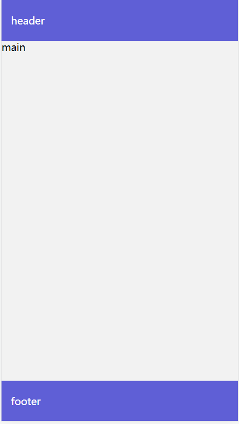

# vue-layout-page
Three line layout for Vue page
<br>

## Features
- Support both Vue 2 & Vue 3
- Support both PC & Mobile
<br>

## Installation

### Vue 3

```bash
npm install vue-layout-page
```

```ts
// import globally in main.js

import VueLayoutPage from 'vue-layout-page'
import 'vue-layout-page/dist/style.css';
app.use(VueLayoutPage)

// in SFC component
<template>
 <VueLayoutPage bodyBgColor="#f2f2f2">
  <!-- your code  -->
 </VueLayoutPage>
</template>

```

```vue
<!-- import locally -->

<template>
  <VueLayoutPage bodyBgColor="#f2f2f2">
  <!-- your code  -->
 </VueLayoutPage>
</template>

<script setup>
import VueLayoutPage from 'vue-layout-page'
import 'vue-layout-page/dist/style.css';
</script>
```

<br>

### Vue 2

```bash
npm install  vue-layout-page
```

```ts
// import globally
import VueLayoutPage from 'vue-layout-page'
import 'vue-layout-page/dist/style.css';
app.use(VueLayoutPage)

```

```vue
<!-- import locally -->

<template>
  <VueLayoutPage bodyBgColor="#f2f2f2">
  <!-- your code  -->
 </VueLayoutPage>
</template>

<script>
import VueLayoutPage from 'vue-layout-page'
import 'vue-layout-page/dist/style.css';
export default {
  components: { VueLayoutPage },
}
</script>
```

<br>

## Props

| Name                    | Description                                                                     |  Type   |
|-------------------------|---------------------------------------------------------------------------------|---------|
| bodyBgColor             | body backgound color                                                            | string  |
| hideHeaderPlaceholder   | hide header placeholder                                                         | boolean  |
| hideFooterPlaceholder   | hide footer placeholder                                                         | boolean  |

<br>

## Preview

